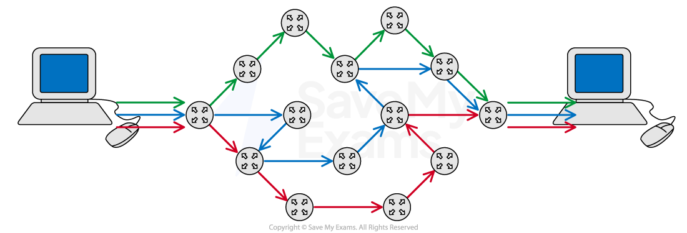
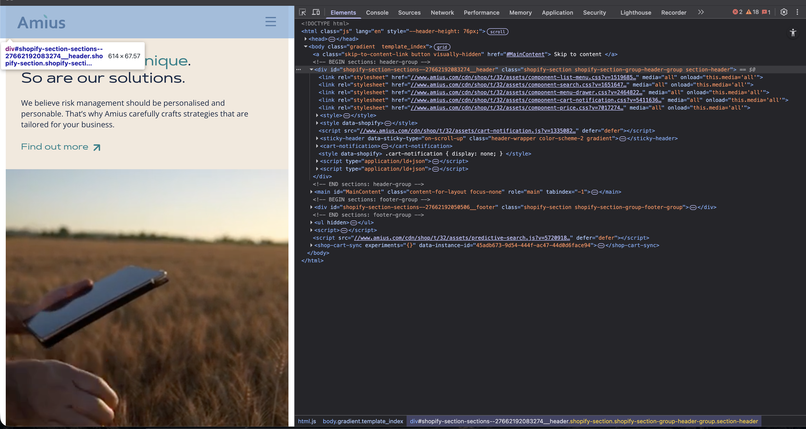

# The Magic Behind the Link: What Really Happens When You Visit a Website

---

The tech world is filled with stuff that most people take for granted, and we're all just used to things working without an appreciation of what's actually going on. Quite often, things that seem simple and work reliably can actually be some of the most complex technology.

I think a perfect example of this is our every day use of the browser.

`Paste link in. Get Website. Simple!`

But it really isn't simple. In order to get here, countless people have spent countless years building all sorts of cool complicated things that enable us to use browsers, and the web as we do.

This post takes a **very, very, very** high-level peek under the hood.

_Mandatory pic of the OG (Tim Berners Lee) who started the world wide web_


---

## First Things First: What is a Link?

Before your browser does anything clever, it needs to understand what you've actually typed. Every part of that link that you typed (technically called a URL—Uniform Resource Locator) has a job.

Let's break down my new favourite website **https://www.amius.com/pages/who-we-are**:

| Part          | Example             | What It Does                                                                       |
| ------------- | ------------------- | ---------------------------------------------------------------------------------- |
| **Protocol**  | `https://`          | The "language" your browser speaks, plus the security level (more on this shortly) |
| **Subdomain** | `www`               | An optional prefix—like a department within a company                              |
| **Domain**    | `amius`             | The unique name—this is the "who" you're trying to reach                           |
| **Extension** | `.com`              | The category (commercial, organisation, country, etc.)                             |
| **Path**      | `/pages/who-we-are` | The specific page you want—like a room number in a building                        |

Your browser parses all of this instantly to figure out: "Right, I need to securely connect to the Amius website and grab their `who-we-are` page."


---

## Finding the Address: DNS (The Internet's Yellow Pages)

So we know what links are, and we know what we want to load, but computers themselves are pretty dumb and don't understand links, instead, they speak numbers. Specifically, IP addresses like `192.168.1.1`.

Think of it like the old Yellow Pages phone book (curious if there is anyone that doesn't know what this is). You know the business name you want to call, but you need to look up their actual phone number first. That's exactly what DNS (Domain Name System) does.


But first, it checks to see if we recently visited that website, no need to re-check the big phone book if you already recently looked it up and can "remember" the phone number.

Here's the lookup chain:

1. **Browser cache** – "Have I visited this site recently?" If yes, skip ahead.
2. **Your device** – Checks its own memory.
3. **Your router** – Asks your home network.
4. **Your ISP's DNS server** – Your internet provider's lookup service.
5. **The wider DNS network** – If nobody knows, the request travels up through a hierarchy of DNS servers until it finds the answer.

Once found, your browser gets back the IP address—the actual "phone number" for Amius' server (which btw is `23.227.38.74`).

Now we can make the call.

_Isn't she pretty_


---

## Making a Secure Connection: Why HTTPS Matters

The 's' at the start of **https://** stands for "secure," and it's doing some important work. When you connect to a website with HTTPS, three things happen:

1. **Verification** – Your browser checks the website's digital certificate to confirm you're actually talking to Amius, not an imposter pretending to be them.

2. **Encryption** – All data travelling between you and the website is scrambled. Even if someone intercepted it, they'd see gibberish.

3. **Integrity** – The data can't be tampered with in transit without detection.

This all happens through something called a **TLS handshake**—a quick back-and-forth where your browser and the server agree on how to encrypt their conversation. It's like two spies agreeing on a secret code before passing notes.

---

## The Request and Response: Asking and Receiving

With a secure connection established, your browser sends an **HTTP request**—essentially a polite note saying: "Hello! Can I please have this page?"

The server receives this, finds the right content, and sends back an **HTTP response** containing:

- **HTML** – The structure and content of the page
- **CSS** – The styling (colours, fonts, layout)
- **JavaScript** – Interactive behaviours
- **Images, fonts, and other assets**

Think of it like ordering at a restaurant. You ask for a meal, the kitchen prepares it, and the waiter brings back all the components—plate, cutlery, condiments—everything needed for the complete experience.

But how does all this data actually travel across the internet?

---

## The Journey Across the Internet: Packets, Routes, and Reassembly

Now we're in the networking part of the journey, things get a bit head-scratchy here and people much smarter than me have built all sorts of protocols for how stuff works. For some light bed-time reading check out the [Transmission Control Protocol (TCP)](https://www.ietf.org/rfc/rfc793.txt), just one of the many amazing things that underpin the internet.

Again, to put it **very, very, very** simply, all that data, your request, the server's response, every image and script doesn't travel as one complete piece. Instead, it gets chopped up into tiny chunks called **packets**. A single webpage might involve thousands of these packets.

### Why Packets?

Imagine trying to transport an entire house across the country in one piece versus flat-packing it into boxes. Packets work the same way—they're easier to route, less likely to cause traffic jams, and if one goes missing, you only need to resend that small piece, not the whole thing.

Each packet is wrapped with crucial information:

- **Source address** – Where it came from (your device)
- **Destination address** – Where it's going (the server)
- **Sequence number** – Its position in the original message (so it can be reassembled)
- **Error-checking data** – To verify nothing got corrupted in transit

_What a packet looks like._


### The Journey: Packets Take Different Routes

For reasons, **your packets don't all take the same path**.

When you visit a website, your request might travel through dozens of different networks, cities, even countries. And each packet can take a completely different route depending on network conditions at that exact moment.

Picture a swarm of delivery drivers all leaving from your house, each carrying one box of your flat-pack furniture. One driver takes the motorway. Another takes A-roads because of traffic. A third goes via a completely different city because a road is closed. They all arrive at the destination at different times, in a random order—but somehow the furniture still gets assembled perfectly.

### Routers: The Traffic Controllers

Along the way, your packets pass through **routers**. These are devices that read the destination address and make split-second decisions about the best next step. "Heavy traffic this way? I'll send you that way instead."

A single request might hop through 15-30 different routers before reaching its destination. Each hop is called a "node," and the whole path is called a "route."

Here's a real example of what a request from the UK to a US server might traverse:

```
Your device (London)
    ↓
Your router
    ↓
ISP network (UK)
    ↓
London Internet Exchange
    ↓
Transatlantic undersea cable
    ↓
New York Internet Exchange
    ↓
US backbone network
    ↓
Regional network
    ↓
Data centre router
    ↓
Destination server
```

Our data physically travels through undersea fibre optic cables spanning thousands of miles, and it happens in **milliseconds**.

_Below, a picture from a computer science GCSE source, packets traversing across different nodes!_



### TCP: The Reliable Delivery Service

Remember those sequence numbers on each packet? This is where **TCP (reminder - Transmission Control Protocol)** works its magic.

TCP acts like a meticulous project manager:

1. **Tracks every packet sent** – "I've dispatched packets 1, 2, 3, 4, 5..."
2. **Waits for acknowledgment** – The destination says "Got packet 1! Got packet 3!"
3. **Notices what's missing** – "Hang on, where's packet 2?"
4. **Requests retransmission** – "Please resend packet 2"
5. **Reassembles in order** – Even if packet 5 arrives before packet 2, TCP holds everything and reconstructs the original sequence

This all happens automatically, invisibly, and incredibly fast. By the time the data reaches its destination, every packet has been verified, reordered, and stitched back together into the complete message as if it was never split apart at all.

### The Scale Is Staggering

Consider this: when you load a modern webpage, you might be receiving:

- HTML from one server
- Images from a CDN (Content Delivery Network) in another country
- Fonts from Google's servers
- Analytics scripts from yet another location

Hundreds of packets, from multiple sources, travelling different routes across the globe, all arriving and assembling into a coherent page, typically in under a second.

The internet is made up of thousands of interconnected networks, all agreeing to pass each other's packets along. And somehow, against all odds, it works reliably billions of times per day.

---

## The Browser: Rendering the Page and Making Things Pretty

Okay, we made a request, it bounced around the world to some server, which responded with a bunch of code. How do we actually get something that looks nice, and that we can interact with on the screen?

Reminder, the server sent back some `HTML, CSS and Javascript files`.

### Step 1: Parsing the HTML → Building the DOM

The browser reads through the HTML and constructs something called the **DOM (Document Object Model)**. Think of it as a family tree of every element on the page—headings, paragraphs, buttons, images, all organised in a hierarchy.

```
Document
  └── html
       ├── head
       │    └── title
       └── body
            ├── header
            ├── main
            │    ├── h1
            │    └── p
            └── footer
```

_Here's what the website DOM tree looks when inspecting the dev tools on our website page (on the right), just a bunch of HTML. doesn't look much like a website! I thought it was interesting to see some 'Shopify' sections here, I wonder what that tells us!_



### Step 2: Parsing the CSS → Building the CSSOM

Simultaneously, the browser processes all the CSS and builds the **CSSOM (CSS Object Model)**—a map of how everything should look. Font sizes, colours, spacing, positioning—it's all catalogued here.

### Step 3: Combining Them → The Render Tree

The browser then merges the DOM and CSSOM into a **Render Tree**. This contains only the visible elements (so hidden things are excluded) along with their styles. It's the blueprint for what will actually appear on screen.

### Step 4: Layout (Reflow)

Now the browser calculates the exact position and size of every element. "This heading is 32 pixels tall and sits 20 pixels from the top." This process is called **layout** or **reflow**.

### Step 5: Painting

Finally, the browser **paints** pixels to your screen—filling in colours, rendering text, drawing borders and shadows. For complex pages, this often gets handed off to your device's **GPU** (graphics processor) for extra speed.

### Step 6: JavaScript Comes Alive

Throughout this process (and after), **JavaScript** runs to add interactivity. Dropdown menus, form validation, animations, dynamic content loading, JS makes pages feel alive rather than static documents.

---

## All of This in Under a Second

Everything we've just covered: URL parsing, DNS lookup, secure connection, packets travelling across continents via different routes, reassembly, request/response, DOM construction, styling, layout, and painting typically happens in **under one second**.

Thousands of packets. Dozens of network hops. Multiple servers. Undersea cables. And your browser stitches it all together seamlessly.

Pretty cool stuff.


---

## Key Takeaways

- **URLs are structured addresses** – every part tells your browser something specific
- **DNS translates names to numbers** – like looking up a phone number in a directory
- **HTTPS keeps your data secure** – essential for any sensitive information
- **Data travels as packets** – split up, routed independently, reassembled perfectly
- **Packets take different routes** – through routers, cables, and countries, arriving in milliseconds
- **TCP ensures reliable delivery** – tracking, verifying, and reordering every packet
- **Your browser builds multiple "trees"** – DOM for structure, CSSOM for style, Render Tree for display
- **It all happens incredibly fast** – milliseconds of coordinated global effort
